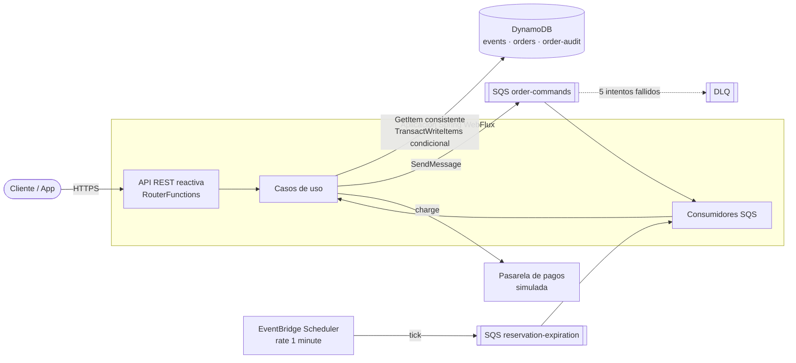
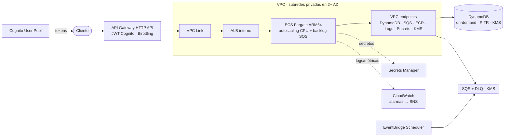
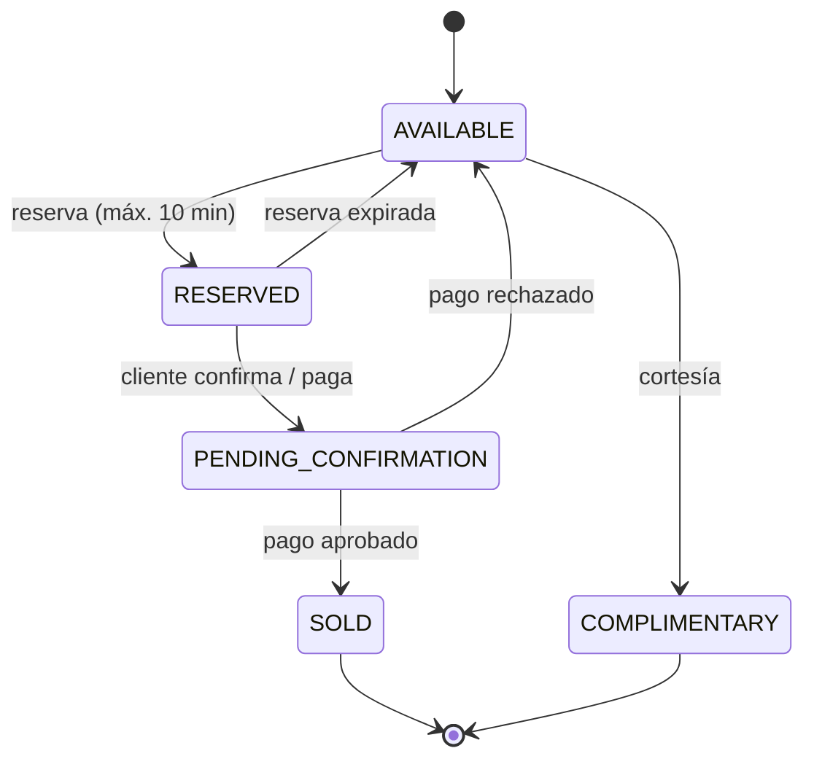
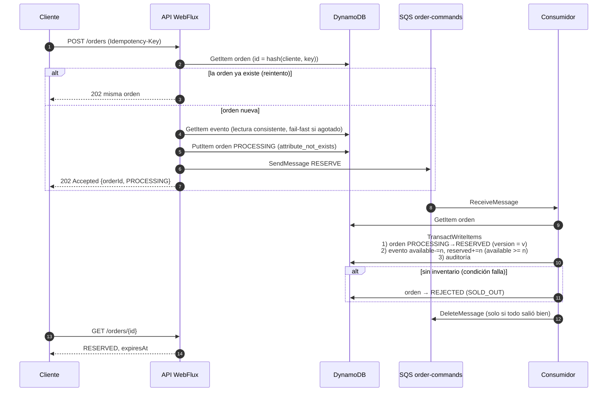
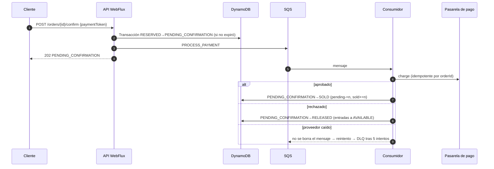
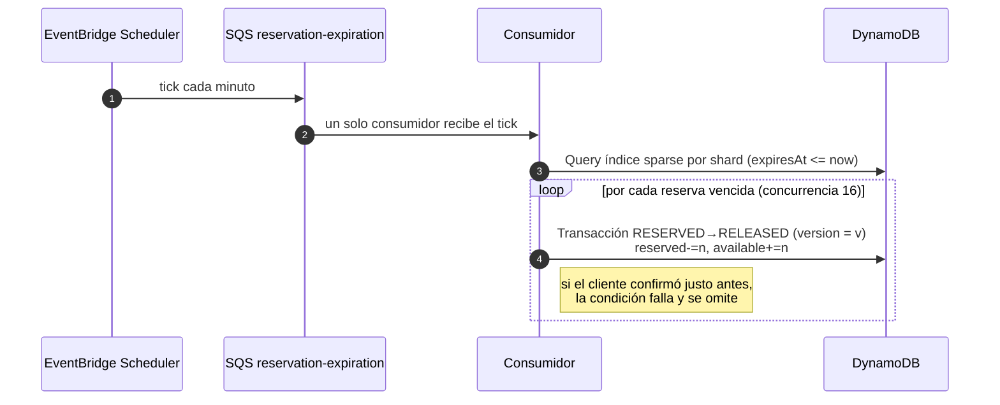

# Ticketing Platform

Backend reactivo para la venta de entradas de eventos con alta concurrencia. Expone una API WebFlux que **encola** las compras en SQS y las procesa con consumidores asíncronos que actualizan el inventario en DynamoDB mediante **escrituras condicionales y transacciones atómicas**, garantizando que nunca se vendan más entradas de las disponibles.

- **Stack:** Java 25 · Spring Boot 4.1 · Spring WebFlux · Project Reactor · AWS SDK v2 (async) · DynamoDB · SQS · EventBridge Scheduler · Docker · Terraform
- **Arquitectura:** Clean Architecture generada con el [scaffold de Bancolombia](https://github.com/bancolombia/scaffold-clean-architecture) v4.7.0
- **Calidad:** 98 % de cobertura de líneas (quality gate del 90 % en el build), tests de concurrencia, test de integración contra DynamoDB y reglas ArchUnit

---

## Contenido

1. [Arquitectura](#1-arquitectura)
2. [Modelo de estados](#2-modelo-de-estados)
3. [Flujos principales](#3-flujos-principales)
4. [Estructura del proyecto](#4-estructura-del-proyecto-clean-architecture)
5. [Decisiones de diseño](#5-decisiones-de-diseño)
6. [Seguridad](#6-seguridad)
7. [Instalación y ejecución](#7-instalación-y-ejecución)
8. [Uso de la API](#8-uso-de-la-api)
9. [Tests y calidad](#9-tests-y-calidad)
10. [Infraestructura en AWS (Terraform)](#10-infraestructura-en-aws-terraform)
11. [Limitaciones y mejoras](#11-limitaciones-mejoras-y-qué-cambiaría-en-producción)
12. [Trazabilidad de requisitos](#12-trazabilidad-de-requisitos)

---

## 1. Arquitectura

### Vista lógica



La API nunca toca el inventario: valida, persiste la orden como `PROCESSING`, la encola y responde `202 Accepted` con el id de la orden. Así absorbe picos de miles de solicitudes con latencia baja (*queue-based load leveling*), mientras los consumidores procesan al ritmo que DynamoDB soporta y escalan horizontalmente según la profundidad de la cola.

### Despliegue en AWS



### Entorno local (docker compose)

| Servicio AWS | Emulador local | Notas |
|---|---|---|
| DynamoDB | `amazon/dynamodb-local` | Tablas e índices creados por `deployment/local/init-dynamodb.sh` |
| SQS | `softwaremill/elasticmq-native` | API compatible con SQS, con DLQ y *redrive policy* (`deployment/local/elasticmq.conf`) |
| EventBridge Scheduler | `scheduler-simulator` | Publica un *tick* cada minuto en la cola de expiración, igual que el *schedule* real |

Se eligió ElasticMQ en lugar de LocalStack porque las versiones recientes de LocalStack exigen un *auth token*, y ElasticMQ implementa fielmente lo que este sistema usa de SQS (long polling, visibility timeout, DLQ). La imagen de la aplicación es la misma en local y en AWS: solo cambian variables de entorno.

---

## 2. Modelo de estados

### Entrada (ticket)



| Estado | ¿Disponible? | ¿Es venta? | Contable | Final |
|---|---|---|---|---|
| `AVAILABLE` | Sí | No | No | No |
| `RESERVED` | No (retenida) | No | No | No |
| `PENDING_CONFIRMATION` | No (retenida) | No | No | No |
| `SOLD` | No | Sí | Sí | Sí, irreversible |
| `COMPLIMENTARY` | No | No | No | Sí |

Las transiciones válidas están codificadas en el dominio (`TicketStatus.allowedTransitions()`); cualquier otra lanza `INVALID_STATE_TRANSITION`. Cada transición es **atómica** (transacción DynamoDB) y **auditable** (se escribe un registro en `order-audit` en la misma transacción).

### Orden

Una orden agrupa las entradas de una compra y comparte su ciclo de vida. Además de los estados de las entradas tiene dos propios:

- `PROCESSING`: aceptada y encolada; todavía no tocó el inventario.
- `REJECTED`: no había inventario cuando el consumidor la procesó (`SOLD_OUT`).

`RELEASED` indica que sus entradas volvieron a `AVAILABLE` (expiración o pago rechazado). La consulta de una orden devuelve tanto `status` (orden) como `ticketStatus` y el estado de cada entrada, cubriendo el requisito de consultar el estado `AVAILABLE / RESERVED / PENDING_CONFIRMATION / SOLD / COMPLIMENTARY`.

---

## 3. Flujos principales

### Compra y reserva



### Confirmación y pago



### Liberación automática de reservas expiradas



---

## 4. Estructura del proyecto (Clean Architecture)

```
ticketing-platform
├── domain
│   ├── model        Entidades, value objects, reglas y puertos (gateways). Sin Spring ni AWS.
│   └── usecase      Orquestación reactiva de los casos de uso. Solo depende de model.
├── infrastructure
│   ├── driven-adapters
│   │   ├── dynamo-db          Repositorios y transacciones DynamoDB (implementa los gateways)
│   │   ├── sqs-sender         Publicador de comandos en SQS
│   │   └── payment-simulator  Pasarela de pago simulada
│   ├── entry-points
│   │   ├── reactive-web       API REST WebFlux (RouterFunctions), errores RFC 9457, seguridad
│   │   └── sqs-listener       Consumidores SQS (órdenes y ticks del scheduler)
│   └── helpers/metrics        Métricas del AWS SDK hacia Micrometer
├── applications/app-service   Arranque Spring Boot, configuración y wiring
├── deployment
│   ├── Dockerfile             Build multi-stage, JRE 25, usuario no root
│   ├── local/                 Init de tablas, colas ElasticMQ y simulador del scheduler
│   └── terraform/             Infraestructura AWS (módulos + entornos dev/prod)
├── postman/                   Colección con los flujos principales
├── scripts/                   Prueba de sobreventa contra el stack local
└── docker-compose.yml
```

El proyecto se generó con el plugin (`ca`, `gda --type=dynamodb|sqs|generic`, `gep --type=webflux|sqs`) y se respetan sus convenciones: la tarea `validateStructure` corre antes de compilar y las reglas ArchUnit generadas (`ArchitectureTest`) se ejecutan con los tests.

**Principios aplicados**

- **Dependency Inversion:** los casos de uso dependen de interfaces del dominio (`EventRepository`, `OrderTransitionGateway`, `OrderCommandPublisher`, `PaymentGateway`); la infraestructura las implementa.
- **Interface Segregation:** la persistencia de transiciones (`OrderTransitionGateway`) está separada de las consultas (`OrderRepository`).
- **Single Responsibility:** un caso de uso por intención (colocar, consultar, confirmar, procesar comando, liberar expiradas).
- **Open/Closed:** cambiar la pasarela simulada por una real es agregar un adaptador, sin tocar el dominio.
- **Java moderno:** `record` para entidades inmutables y DTOs, jerarquía de excepciones `sealed` con `switch` de *pattern matching* exhaustivo, `sealed interface PaymentResult` (`Approved | Declined`), `Math.clamp`.

---

## 5. Decisiones de diseño

### 5.1 Control de concurrencia: la base de datos es la fuente de verdad

La sobreventa se evita en DynamoDB, no en memoria ni con locks distribuidos. Cada cambio de estado es **una transacción** (`TransactWriteItems`) con tres escrituras:

| # | Escritura | Condición | Qué garantiza |
|---|---|---|---|
| 1 | `Put` de la orden con el nuevo estado y `version + 1` | `status = :esperado AND version = :leida` | **Optimistic locking:** si otro proceso cambió la orden (reintento duplicado, confirmación vs. expiración), la transacción falla |
| 2 | `Update` del evento: `ADD available :-n, reserved :n` | `available >= :n` | **Conditional write:** imposible dejar contadores negativos, es decir, imposible sobrevender |
| 3 | `Put` del registro de auditoría | `attribute_not_exists(sequence)` | Historial *append-only*, uno por versión |

¿Por qué contadores atómicos con `ADD` en vez de leer-modificar-escribir con versión sobre el evento? Porque en una salida a la venta miles de compras tocan el **mismo** ítem: con optimistic locking puro casi todas fallarían y reintentarían (*livelock*). `ADD` + condición deja que DynamoDB serialice las actualizaciones y solo falla cuando realmente no hay entradas.

El error de cancelación se traduce según el ítem que falló: orden → `ORDER_STATE_CHANGED` (se re-lee y re-evalúa), evento → `INSUFFICIENT_INVENTORY` (la orden pasa a `REJECTED`), `TransactionConflict` → error técnico reintentable con *backoff* exponencial y *jitter*.

> Verificado con DynamoDB real: `OrderTransitionDynamoIT` lanza 100 reservas concurrentes sobre 30 entradas y obtiene exactamente 30 `RESERVED` y 70 `INSUFFICIENT_INVENTORY`.

### 5.2 Procesamiento asíncrono y entrega *at-least-once*

- La API responde `202` en milisegundos; la cola absorbe el pico.
- El consumidor **solo borra el mensaje cuando el procesamiento termina bien**. Si falla o la instancia muere, el mensaje reaparece al vencer el *visibility timeout*. Tras 5 intentos va a la **DLQ** (alarma en CloudWatch).
- Como un mensaje puede llegar más de una vez, **todos los handlers son idempotentes**: re-leen la orden y solo actúan si está en el estado que el comando espera; de lo contrario confirman el mensaje sin efectos.
- Los rechazos de negocio (p. ej. transición inválida) se confirman, porque reintentar no cambia el resultado; los errores técnicos se propagan para que SQS reintente.

**Cola estándar, no FIFO.** El orden de llegada no aporta a la corrección (la garantiza la escritura condicional) y FIFO limitaría el *throughput*. El trade-off: no hay "fila justa" estricta por orden de llegada; si el negocio la exige, ver [mejoras](#11-limitaciones-mejoras-y-qué-cambiaría-en-producción).

### 5.3 Idempotencia de la API

- `POST /orders` exige `Idempotency-Key`. El id de la orden es `UUIDv3(tipo, cliente, key)`: un reintento del cliente (timeout, doble clic, ataque de *replay*) **siempre** resuelve a la misma orden y nunca crea una segunda.
- Reutilizar la misma key con otro payload devuelve `422 IDEMPOTENCY_KEY_REUSED`.
- Si la orden quedó `PROCESSING` (p. ej. falló el envío a SQS después de guardarla), el reintento **re-publica** el comando: es seguro porque el consumidor es idempotente. Esto cubre la brecha entre "guardar" y "publicar" sin un *outbox* completo.
- La confirmación es idempotente de la misma forma, y el cobro usa el `orderId` como clave de idempotencia con el proveedor.
- Los ids de las entradas se derivan del id de la orden: estables entre reintentos y sin usar `SecureRandom` dentro de hilos reactivos (BlockHound detectó esa llamada bloqueante durante los tests).

### 5.4 Reserva temporal y expiración

- La reserva dura `ticketing.reservation.ttl` (por defecto 10 min; el dominio rechaza valores mayores).
- Las órdenes `RESERVED` escriben `expirationShard` y `expiresAt`, que forman un **GSI *sparse***: el índice solo contiene reservas vivas. Al confirmar o liberar, esos atributos desaparecen y la orden sale del índice. No hay `Scan`.
- El índice se particiona en **8 shards** (`SHARD#0..7`) para que miles de reservas simultáneas no saturen una sola partición del GSI.
- **EventBridge Scheduler → SQS → consumidor**, en lugar de un `@Scheduled` en la aplicación: con N réplicas, solo una procesa cada *tick* (quien recibe el mensaje); si falla, SQS reintenta; el *schedule* se gestiona como infraestructura y se puede pausar sin desplegar.
- La carrera "el cliente confirma justo cuando expira" se resuelve con la condición de versión: gana exactamente uno (`ConcurrencyTest.confirmationRacingWithExpirationHasASingleWinner`).

### 5.5 Disponibilidad en tiempo real

- `GET /events/{id}/availability` usa **lectura fuertemente consistente**: refleja todas las transacciones confirmadas, separando `available`, `reserved`, `pendingConfirmation` (`onHold`), `sold` y `complimentary`.
- `GET /events/{id}/availability/stream` emite **Server-Sent Events** cada vez que cambia el inventario (`distinctUntilChanged`), con *backpressure* (`onBackpressureDrop`) y duración máxima para no acumular conexiones.

### 5.6 Pre-chequeo *fail-fast*

Antes de encolar, la API rechaza con `409` si el evento ya no tiene entradas. Es una optimización para no inundar la cola con pedidos imposibles cuando el evento se agota; **no** es la garantía (entre el chequeo y el consumo puede cambiar), la garantía es la escritura condicional.

### 5.7 Reactividad de punta a punta

- Clientes AWS **asíncronos** (`DynamoDbAsyncClient`, `SqsAsyncClient`) adaptados con `Mono.fromFuture`; ningún hilo se bloquea esperando I/O.
- Reintentos con `Retry.backoff` + *jitter* solo para errores técnicos reintentables.
- **BlockHound** está activo en todos los tests y falla ante cualquier llamada bloqueante en hilos reactivos.
- **Virtual threads:** no se usan. Con WebFlux y clientes asíncronos no hay código bloqueante que delegar; mezclar ambos modelos complicaría el razonamiento sin beneficio. Serían la elección natural si se usara un stack imperativo (Spring MVC + clientes síncronos).

### 5.8 Errores

Jerarquía `sealed`: `TicketingException` → `BusinessException` (regla de negocio, no reintentable) | `TechnicalException` (infraestructura, con flag `retryable`). La API traduce con un `switch` exhaustivo a **RFC 9457 Problem Details** (`application/problem+json`): 400 / 404 / 409 / 422, y `503 + Retry-After` para fallas transitorias. Nunca se exponen trazas ni mensajes internos.

---

## 6. Seguridad

| Amenaza | Mitigación |
|---|---|
| Secretos en el código | No hay. En AWS la API key administrativa vive en **Secrets Manager** (cifrada con KMS) y ECS la inyecta al arrancar; las credenciales AWS vienen del **rol de la tarea** (sin access keys). En local se usan valores *dummy* |
| Suplantación de cliente | `X-Customer-Id` lo sobrescribe **API Gateway** con el claim `sub` del JWT validado de Cognito; lo que envíe el cliente se descarta. En rutas públicas se elimina |
| Acceso a órdenes ajenas | Cada consulta/confirmación verifica que la orden pertenezca al cliente; si no, responde `404` (no revela que existe) |
| Operaciones administrativas | Requieren el *scope* OAuth `ticketing/admin` en API Gateway **y** la API key en la aplicación (defensa en profundidad). Comparación en tiempo constante; si no hay key configurada, se rechaza todo (*fail closed*) |
| Reintentos maliciosos / *replay* | `Idempotency-Key` obligatoria y id de orden determinista: repetir una solicitud no crea compras duplicadas |
| Abuso de recursos / acaparamiento | Máximo 10 entradas por orden, reservas que expiran, *throttling* en API Gateway, validación estricta de entradas (formatos y longitudes), *streams* SSE con duración acotada |
| Tormentas de reintentos | *Backoff* exponencial con *jitter*, `Retry-After` en 503, DLQ para mensajes venenosos |
| Datos en tránsito y en reposo | DynamoDB, SQS, logs, SNS y ECR cifrados con **KMS (CMK con rotación)**; las colas niegan tráfico sin TLS; tráfico a AWS por **VPC endpoints** |
| Superficie de red | Tareas en subredes privadas sin IP pública; ALB interno solo accesible desde el VPC link; *security groups* mínimos; VPC Flow Logs |
| Privilegios | Rol de tarea de mínimo privilegio por tabla/cola (la auditoría solo admite `PutItem`, es *append-only*) |
| Contenedor | Imagen JRE, usuario no root, sistema de archivos de solo lectura en ECS, imágenes inmutables con escaneo en ECR |
| Datos de pago | La API solo recibe un **token** de la pasarela; nunca datos de tarjeta |
| Cabeceras HTTP | CSP, HSTS, `X-Content-Type-Options`, `Referrer-Policy`, `Cache-Control: no-store`; CORS restringido a orígenes configurados |

---

## 7. Instalación y ejecución

### Requisitos

- Docker Desktop (o Docker Engine + Compose v2).
- Opcional, para compilar fuera de Docker: JDK 25. El wrapper de Gradle (9.8) viene incluido.

### Levantar todo con Docker

```bash
docker compose up --build -d
```

Levanta DynamoDB Local, ElasticMQ, crea las tablas, inicia el simulador del scheduler y la aplicación en `http://localhost:8080`. La compilación ocurre dentro de la imagen (JDK 25), no hace falta tener Java instalado.

```bash
curl http://localhost:8080/actuator/health
```

Variables útiles (en un archivo `.env` o en la línea de comandos):

| Variable | Por defecto | Uso |
|---|---|---|
| `ADMIN_API_KEY` | `local-admin-key` | API key de los endpoints administrativos |
| `RESERVATION_TTL` | `10m` | Duración de la reserva (útil `30s` para probar la expiración) |
| `SCHEDULE_INTERVAL_SECONDS` | `60` | Frecuencia del simulador de EventBridge Scheduler |

Probar la expiración en segundos:

```bash
RESERVATION_TTL=30s SCHEDULE_INTERVAL_SECONDS=10 docker compose up -d
```

- Consola de ElasticMQ (colas y DLQ): http://localhost:9325
- Logs de la aplicación: `docker compose logs -f app`
- Apagar y limpiar: `docker compose down`

### Compilar y testear sin Docker

```bash
./gradlew build
./gradlew test jacocoMergedReport jacocoMergedCoverageVerification
```

El reporte HTML de cobertura queda en `build/reports/jacocoMergedReport/html/index.html`.

---

## 8. Uso de la API

Base: `http://localhost:8080/api/v1`. La colección de Postman (`postman/ticketing-platform.postman_collection.json`) recorre todos los flujos y guarda los ids automáticamente.

| Método | Ruta | Descripción | Headers |
|---|---|---|---|
| `POST` | `/events` | Crear evento | `X-Api-Key` |
| `GET` | `/events?limit=20` | Próximos eventos (ordenados por fecha) | |
| `GET` | `/events/{eventId}` | Detalle del evento | |
| `GET` | `/events/{eventId}/availability` | Disponibilidad en tiempo real | |
| `GET` | `/events/{eventId}/availability/stream` | Disponibilidad por SSE | |
| `POST` | `/events/{eventId}/complimentary-tickets` | Emitir cortesías | `X-Api-Key`, `Idempotency-Key` |
| `POST` | `/orders` | Iniciar compra (encola, responde 202) | `X-Customer-Id`, `Idempotency-Key` |
| `GET` | `/orders/{orderId}` | Estado de la orden | `X-Customer-Id` |
| `POST` | `/orders/{orderId}/confirm` | Confirmar y pagar | `X-Customer-Id` |

### Ejemplo completo con curl

```bash
# 1. Crear un evento (back-office)
curl -s -X POST http://localhost:8080/api/v1/events \
  -H 'Content-Type: application/json' -H 'X-Api-Key: local-admin-key' \
  -d '{"name":"Rock al Parque","venue":"Parque Simon Bolivar","startsAt":"2027-08-15T20:00:00Z","totalCapacity":100}'
# => 201 {"id":"<eventId>", ..., "availableTickets":100}

# 2. Comprar 2 entradas
curl -s -X POST http://localhost:8080/api/v1/orders \
  -H 'Content-Type: application/json' -H 'X-Customer-Id: customer-123' -H 'Idempotency-Key: 6f1c2a9e-0001' \
  -d '{"eventId":"<eventId>","quantity":2}'
# => 202 {"orderId":"<orderId>","status":"PROCESSING", ...}

# 3. Consultar la orden (en milisegundos pasa a RESERVED)
curl -s http://localhost:8080/api/v1/orders/<orderId> -H 'X-Customer-Id: customer-123'
# => {"status":"RESERVED","ticketStatus":"RESERVED","expiresAt":"...","tickets":[{"ticketId":"...","status":"RESERVED"}, ...]}

# 4. Disponibilidad
curl -s http://localhost:8080/api/v1/events/<eventId>/availability
# => {"available":98,"reserved":2,"pendingConfirmation":0,"onHold":2,"sold":0,"complimentary":0, ...}

# 5. Confirmar con un token de pago
curl -s -X POST http://localhost:8080/api/v1/orders/<orderId>/confirm \
  -H 'Content-Type: application/json' -H 'X-Customer-Id: customer-123' \
  -d '{"paymentToken":"tok_visa_approved"}'
# => 202 {"status":"PENDING_CONFIRMATION", ...}  y luego GET => "SOLD"

# 6. Seguir la disponibilidad en vivo
curl -N http://localhost:8080/api/v1/events/<eventId>/availability/stream
```

Tokens de la pasarela simulada: `tok_declined*` (rechazado → entradas liberadas), `tok_unavailable*` (proveedor caído → reintentos → DLQ), cualquier otro se aprueba.

Ejemplo de error (RFC 9457):

```json
{
  "type": "urn:ticketing:error:idempotency_key_reused",
  "title": "IDEMPOTENCY_KEY_REUSED",
  "status": 422,
  "detail": "The idempotency key was already used with a different payload"
}
```

---

## 9. Tests y calidad

```bash
./gradlew test jacocoMergedReport jacocoMergedCoverageVerification
```

| Tipo | Qué cubre | Ejemplos |
|---|---|---|
| Dominio | Máquina de estados, inventario, validaciones, idempotencia | `TicketStatusTest`, `OrderTest`, `EventTest` |
| Casos de uso (mocks) | Cada rama de negocio, reintentos y reevaluación ante estado obsoleto, con `StepVerifier` y tiempo virtual | `PlaceOrderUseCaseTest`, `ProcessOrderCommandUseCaseTest`, `ConfirmAndGetOrderUseCaseTest` |
| **Concurrencia** | 200 compras paralelas sobre 50 entradas (5 repeticiones), mensajes duplicados, carrera confirmación vs. expiración | `ConcurrencyTest` |
| Adaptadores | Expresiones y condiciones enviadas a DynamoDB, traducción de errores de transacción, SQS (borrado solo si hay éxito) | `OrderTransitionDynamoAdapterTest`, `SQSListenerTest` |
| WebFlux | Rutas, códigos HTTP, seguridad, SSE, cabeceras, CORS | `RouterRestTest`, `ConfigTest` |
| Arquitectura | Reglas del scaffold (ArchUnit) | `ArchitectureTest` |
| Integración | Transacciones reales contra DynamoDB Local | `OrderTransitionDynamoIT` |

**Cobertura actual: 98,2 % de líneas, 92,5 % de ramas** (umbral del 90 % aplicado por `jacocoMergedCoverageVerification`).

### Test de integración contra DynamoDB Local

Con el stack levantado (`docker compose up -d`):

```bash
DYNAMODB_IT_ENDPOINT=http://localhost:8000 ./gradlew :dynamo-db:test --tests '*OrderTransitionDynamoIT'
```

### Prueba de sobreventa contra la aplicación corriendo

```bash
./scripts/concurrency-test.sh 50 300 100   # capacidad, solicitudes, paralelismo
```

Crea un evento de 50 entradas, dispara 300 compras concurrentes de clientes distintos y verifica que exactamente 50 queden reservadas y el inventario cuadre.

---

## 10. Infraestructura en AWS (Terraform)

```
deployment/terraform
├── modules
│   ├── network        VPC, subredes públicas/privadas multi-AZ, NAT, VPC endpoints, flow logs
│   ├── security       KMS (CMK con rotación) y secreto de la API key en Secrets Manager
│   ├── data           Tablas DynamoDB (on-demand, PITR, KMS, deletion protection, GSIs)
│   ├── messaging      Colas SQS + DLQ, redrive, cifrado KMS, política solo-TLS
│   ├── scheduler      EventBridge Scheduler rate(1 minute) → SQS, con retry policy y DLQ
│   ├── compute        ECR, ECS Fargate ARM64, ALB interno, IAM mínimo privilegio, autoscaling
│   ├── edge           API Gateway HTTP API, VPC link, Cognito (JWT + scope admin), throttling, access logs
│   ├── observability  Alarmas (DLQ, lag de la cola, 5xx, throttling DynamoDB) → SNS, dashboard
│   └── platform       Composición de todos los módulos para un entorno
└── environments
    ├── dev            1 NAT, 1-4 tareas, sin deletion protection, logs 14 días
    └── prod           NAT por AZ, 3-30 tareas, deletion protection, logs 90 días
```

```bash
cd deployment/terraform/environments/dev
terraform init
terraform plan -var image_tag=<git-sha>
terraform apply -var image_tag=<git-sha>
```

Ambos entornos pasan `terraform validate` y `terraform fmt -check`.

**Decisiones**

- **Networking:** las tareas viven en subredes privadas; DynamoDB y S3 se acceden por *gateway endpoints* (gratuitos) y SQS/ECR/Logs/Secrets/KMS por *interface endpoints*, de modo que el tráfico de datos no pasa por el NAT (menos costo y menos superficie). Un NAT por AZ en prod evita que la caída de una AZ deje sin salida a las demás.
- **Entrada:** API Gateway HTTP API valida los JWT de Cognito, aplica *throttling* y llega al ALB interno por un VPC link. Se eligió HTTP API (más barato y de menor latencia que REST API).
- **Escalabilidad:** DynamoDB *on-demand* absorbe picos sin planificar capacidad; ECS escala por CPU y, sobre todo, por **backlog de la cola** (en una salida a la venta la cola crece antes que la CPU).
- **Resiliencia:** multi-AZ, *deployment circuit breaker* con rollback automático, *graceful shutdown* alineado con el *deregistration delay* del ALB, DLQ en todas las colas, PITR en todas las tablas.
- **Aislamiento de entornos:** un estado de Terraform por entorno (backend S3 con *locking* nativo) y nombres prefijados por entorno. Lo recomendado es además **una cuenta AWS por entorno** (AWS Organizations + SCPs).
- **Costos:** Fargate ARM64 (Graviton, ~20 % más barato), DynamoDB *on-demand*, *long polling* en SQS, retención de logs acotada, 1 NAT en dev, *lifecycle* en ECR.
- **Observabilidad y gobernanza:** logs estructurados (ECS JSON) en CloudWatch cifrados, Container Insights, métricas Prometheus y del SDK de AWS vía Micrometer, alarmas accionables, `default_tags` (proyecto, entorno, centro de costos) en todos los recursos.

---

## 11. Limitaciones, mejoras y qué cambiaría en producción

**Limitaciones conocidas**

- **Partición caliente del evento.** Todas las reservas de un evento actualizan el mismo ítem: un ítem de DynamoDB soporta ~1.000 WCU/s y una transacción consume el doble, es decir, unas ~500 reservas/s por evento. La cola amortigua el pico, pero para eventos masivos usaría **inventario particionado** (N "cubetas" por evento, cada una con su contador, eligiendo una al azar y probando otra si se agotó).
- **Sin fila justa.** Con cola estándar y consumidores en paralelo no se respeta estrictamente el orden de llegada. Para preventas muy disputadas agregaría una **sala de espera virtual** (tokens de turno) o SQS FIFO agrupado por evento.
- **Brecha entre persistir y publicar.** Se mitiga re-publicando en reintentos idempotentes, pero si el cliente nunca reintenta la orden queda en `PROCESSING`. En producción usaría un **outbox con DynamoDB Streams → EventBridge Pipes → SQS**, o un barrido periódico de órdenes `PROCESSING` antiguas.
- **Pagos colgados.** Si el proveedor falla de forma persistente el mensaje termina en la DLQ y la orden queda en `PENDING_CONFIRMATION`. Faltaría un proceso de **reconciliación** con el proveedor y un timeout de confirmación que libere las entradas.
- **SSE detrás de API Gateway.** El timeout de integración de HTTP API es de 30 s, así que el *stream* se corta (EventSource reconecta solo). Para tiempo real a gran escala usaría **API Gateway WebSockets o AppSync** alimentados por DynamoDB Streams en lugar de *polling*.
- **Autenticación simplificada en local.** Localmente el cliente se identifica con `X-Customer-Id` y el back-office con API key; la validación de JWT ocurre en API Gateway (Terraform).
- **Sin precio ni asientos numerados.** El modelo usa entradas de admisión general; asientos numerados requerirían un ítem por asiento y reservas por asiento.

**Mejoras siguientes**

- Trazas distribuidas con OpenTelemetry (API → SQS → consumidor) y métricas de negocio (ventas, reservas expiradas, tasa de rechazo).
- Separar API y consumidores en dos servicios ECS para escalarlos de forma independiente.
- DynamoDB Streams para alimentar reportes (contables, inventario) y archivar la auditoría en S3 (con TTL en la tabla).
- WAF delante del API (CloudFront + WAF o REST API) con límites por IP/cliente, y *rate limiting* por cliente en la aplicación.
- Pipeline CI/CD (GitHub Actions con OIDC hacia AWS, sin llaves): build, tests, Sonar, escaneo de imagen, `terraform plan` en PR y despliegue *blue/green*.
- Pruebas de carga (k6/Gatling) para dimensionar shards, tareas y umbrales de autoscaling.

---

## 12. Trazabilidad de requisitos

| Requisito | Implementación |
|---|---|
| 1. Gestión de eventos | `CreateEventUseCase`, `QueryEventsUseCase`; inventario por estado en el ítem del evento |
| 2. Reserva temporal (máx. 10 min) | `Order.reserve`, `ReservationPolicy` (rechaza > 10 min), liberación automática |
| 3. Procesamiento asíncrono | `PlaceOrderUseCase` (encola y responde 202) + `ProcessOrderCommandUseCase` vía SQS |
| 4. Consulta de estado de orden | `GET /orders/{id}` con `status`, `ticketStatus` y estado por entrada |
| 5. Control de concurrencia | Transacción DynamoDB con *optimistic locking* + *conditional writes*; `ConcurrencyTest`, `OrderTransitionDynamoIT` |
| 6. Liberación de reservas expiradas | EventBridge Scheduler → SQS → `ReleaseExpiredReservationsUseCase` sobre GSI *sparse* con shards |
| 7. Disponibilidad reactiva | `GET /availability` (lectura consistente) y `/availability/stream` (SSE) |
| Java 25, Spring Boot 4, WebFlux | Records, `sealed`, *pattern matching*; Spring Boot 4.1.1; API 100 % `Mono`/`Flux` |
| Manejo de errores reactivo con retry | `RetryPolicies` (backoff + jitter, solo errores reintentables), Problem Details |
| SQS *at-least-once* | Borrado tras éxito, *visibility timeout*, DLQ, handlers idempotentes |
| Docker / docker-compose | `deployment/Dockerfile` multi-stage, `docker-compose.yml` con todas las dependencias |
| Tests ≥ 90 % | 98,2 % de líneas con JUnit 5, Mockito, reactor-test, BlockHound |
| Colección de solicitudes | `postman/ticketing-platform.postman_collection.json` |
| IaC (diferencial) | `deployment/terraform` con módulos y entornos dev/prod |
